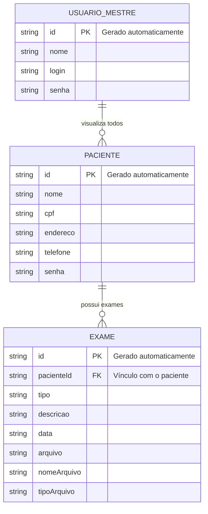

Perfeito — vou separar certinho pra você copiar 👇

---

# 📄 PRD - Prontuário Eletrônico

## 1. Visão Geral e Objetivo

O **Prontuário Eletrônico** é uma aplicação web didática que permite o cadastro e gerenciamento de informações de pacientes e seus exames médicos (raio-x, tomografia, exames laboratoriais, etc.).

**O grande diferencial (Regra de Negócio Principal):** O sistema permite que o próprio paciente seja responsável pelo seu prontuário, podendo cadastrar, visualizar, remover e armazenar arquivos (imagem ou PDF) dos seus exames de forma simples e centralizada, enquanto um usuário mestre possui acesso global para auditoria e controle de todos os registros.

---

## 2. Atores do Sistema

* **Visitante:** Usuário não autenticado que acessa a página inicial e deseja se cadastrar como paciente.
* **Paciente:** Usuário autenticado que pode gerenciar seus dados pessoais e exames.
* **Usuário Mestre (Administrador):** Usuário com acesso total ao sistema, podendo visualizar todos os pacientes e seus respectivos exames.

---

## 3. Histórias de Usuário e Escopo

### 👤 Épico 1: Autenticação e Cadastro

* **US01 - Autocadastro de Paciente:** Como um Visitante, quero preencher um formulário com meus dados pessoais (Nome, CPF, Endereço, Telefone, Senha) para criar meu prontuário eletrônico.

  * *Critérios de Aceitação:* Todos os campos são obrigatórios; o CPF deve ser válido; o paciente deve ser cadastrado com sucesso no sistema.

* **US02 - Acesso ao Sistema (Login):** Como um Paciente, quero inserir meu CPF e Senha para acessar meu prontuário.

---

### 🧪 Épico 2: Gerenciamento de Exames

* **US03 - Cadastrar Exame:** Como um Paciente logado, quero inserir informações sobre meus exames (tipo, descrição, data) e anexar um arquivo (imagem ou PDF), para manter meu histórico atualizado.

  * *Critérios de Aceitação:* O tipo de exame deve ser informado; todos os campos são obrigatórios; deve ser possível anexar arquivo (imagem ou PDF); o exame deve ser vinculado ao paciente.

* **US04 - Visualizar Exames:** Como um Paciente, quero visualizar a lista dos exames que cadastrei, incluindo acesso ao arquivo anexado.

  * *Critérios de Aceitação:* A lista deve exibir tipo, data, descrição e permitir visualizar/baixar o arquivo.

* **US05 - Remover Exame:** Como um Paciente, quero remover exames cadastrados.

  * *Critérios de Aceitação:* O sistema deve permitir excluir exames e seus arquivos associados.

---

### 📊 Épico 3: Controle e Administração

* **US06 - Visualizar Pacientes e Exames (Administrador):** Como um Usuário Mestre, quero visualizar todos os pacientes e seus exames, incluindo arquivos anexados.

  * *Critérios de Aceitação:* O sistema deve listar pacientes e permitir visualizar exames com tipo, data, descrição e arquivo.

---

# 🛠️ TECH SPEC - Prontuário Eletrônico

## 1. Modelo de Dados (Diagrama ER)



---

## 2. Dicionário de Dados

* **Pacientes:** Armazena dados pessoais e de autenticação.

  * id: Identificador único
  * cpf: Chave de acesso
  * endereco: Endereço do paciente
  * telefone: Contato
  * senha: Acesso ao sistema

* **Exames:** Histórico médico com arquivos.

  * pacienteId: Vínculo com paciente
  * tipo: Tipo do exame
  * descricao: Detalhes
  * data: Data do exame
  * arquivo: URL ou base64
  * nomeArquivo: Nome do arquivo
  * tipoArquivo: pdf, jpg, png

* **Usuário Mestre:** Administrador do sistema.

  * login: Acesso
  * senha: Senha

---

## 3. Rotas da API (JSON Server)

* `GET /pacientes`
* `POST /pacientes`
* `GET /exames?pacienteId=1`
* `POST /exames`
* `DELETE /exames/:id`
* `GET /usuario_mestre`

---

## 4. Estrutura do Banco de Dados (db.json)

```json
{
  "pacientes": [
    {
      "id": "1",
      "nome": "Maria Souza",
      "cpf": "12345678900",
      "endereco": "Rua das Flores, 123",
      "telefone": "44999999999",
      "senha": "senha_segura"
    }
  ],
  "exames": [
    {
      "id": "1",
      "pacienteId": "1",
      "tipo": "Exame de Sangue",
      "descricao": "Hemograma completo",
      "data": "2026-03-20",
      "arquivo": "base64_ou_url_aqui",
      "nomeArquivo": "exame.pdf",
      "tipoArquivo": "pdf"
    }
  ],
  "usuario_mestre": [
    {
      "id": "1",
      "nome": "Administrador",
      "login": "admin",
      "senha": "admin123"
    }
  ]
}
```

---

Se quiser, próximo passo posso:
👉 montar o **backend em TypeScript sem usar for (igual você pediu antes)**
👉 ou criar já as **requisições prontas (fetch/axios)**
