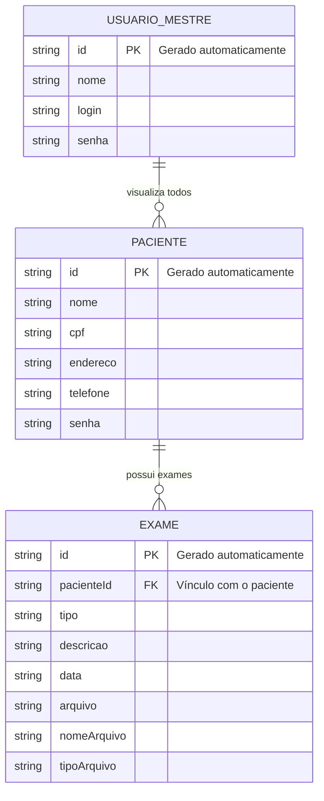

# 🛠️ Especificação Técnica TECH SPEC - Med Vew

## 1. Modelo de Dados (Diagrama ER)



---

## 2. Dicionário de Dados

* **Pacientes:** Armazena dados pessoais e de autenticação.

  * id: Identificador único
  * cpf: Chave de acesso
  * endereco: Endereço do paciente
  * telefone: Contato
  * senha: Acesso ao sistema

* **Exames:** Histórico médico com arquivos.

  * pacienteId: Vínculo com paciente
  * tipo: Tipo do exame
  * descricao: Detalhes
  * data: Data do exame
  * arquivo: URL ou base64
  * nomeArquivo: Nome do arquivo
  * tipoArquivo: pdf, jpg, png

* **Usuário Mestre:** Administrador do sistema.

  * login: Acesso
  * senha: Senha

---

## 3. Rotas da API (JSON Server)

* `GET /pacientes`
* `POST /pacientes`
* `GET /exames?pacienteId=1`
* `POST /exames`
* `DELETE /exames/:id`
* `GET /usuario_mestre`

---

## 4. Estrutura do Banco de Dados (db.json)

```json
{
  "pacientes": [
    {
      "id": "1",
      "nome": "Maria Souza",
      "cpf": "12345678900",
      "endereco": "Rua das Flores, 123",
      "telefone": "44999999999",
      "senha": "senha_segura"
    }
  ],
  "exames": [
    {
      "id": "1",
      "pacienteId": "1",
      "tipo": "Exame de Sangue",
      "descricao": "Hemograma completo",
      "data": "2026-03-20",
      "arquivo": "base64_ou_url_aqui",
      "nomeArquivo": "exame.pdf",
      "tipoArquivo": "pdf"
    }
  ],
  "usuario_mestre": [
    {
      "id": "1",
      "nome": "Administrador",
      "login": "admin",
      "senha": "admin123"
    }
  ]
}
```


5. Tecnologias Empregadas
   Bootstrap 5.3.3 CSS
   API ViaCEP API v1

   Garante a versão mais tualizada das tecnologia CSS e a API permite a automatização dos cadastro de novo usuario dos sistema.
